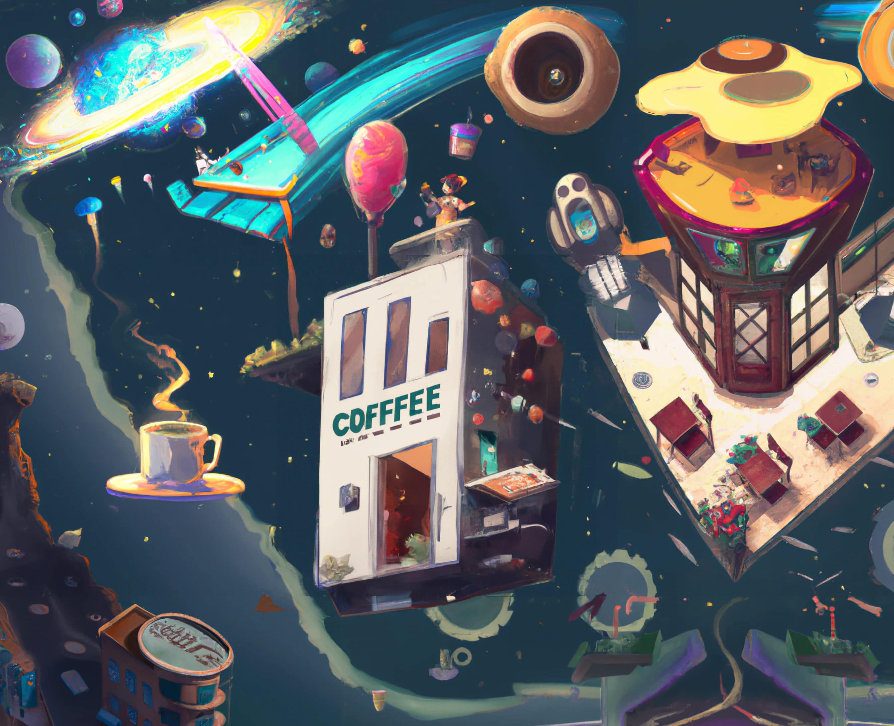
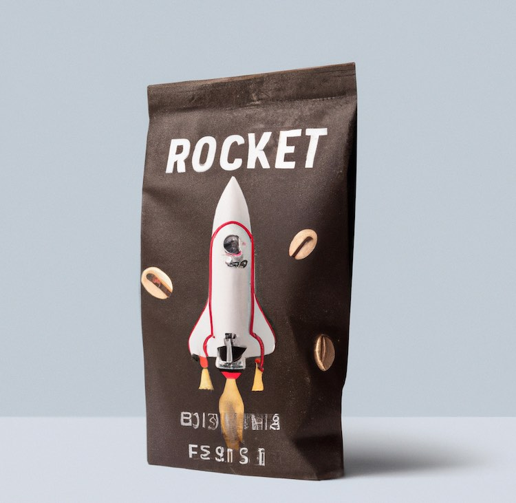

## Welcome to the COFFFEE Shop



## About

The COFFFEE Shop was a weekend project mainly created to expand my understanding of the Next.js framework as well as explore the viability of using AI image and text generation tools in the design process. All images and text on the site were generated using OpenAi’s [Dall-E 2](https://openai.com/dall-e-2/) and their corresponding [text api](https://beta.openai.com/). These assets were included on the site as is - no alterations or edits were made outside of OpenAi’s platform.

Overall, I was incredible impressed with what the OpenAi team has come up with and was pleasantly surprised by how easy it was to incorporate and refine a style for a site / brand by using AI generated assets.

You can checkout the final hosted product at: https://cofffee-shop.vercel.app/

## Design

I make all my Figma mocks publicly available for those who are curious about my design process or just want to tinker with the layout in their own way. For the COFFFEE Shop those mocks can be seen [here](https://www.figma.com/file/FjfhOf31XhGdNPmoGRsmX9/COFFFEE-SHOP?node-id=0%3A3). Additionally, all assets on the site are available in the [assets folder](./public/assets/) of this repo.

|               Coffee Cups Floating In Space                |              Coffee Beans With A Rocket Logo              |
| :--------------------------------------------------------: | :-------------------------------------------------------: |
| ! |  |

## Running Locally

This project was created using [Next.js](https://nextjs.org/) and can be run locally with:

```bash
npm run dev
# or
yarn dev
```

Open http://localhost:3000 with your browser to see the result.

## Deployment

This app was was deployed on the [Vercel Platform](https://vercel.com/new?utm_medium=default-template&filter=next.js&utm_source=create-next-app&utm_campaign=create-next-app-readme). Deploying on vercel is the easiest way to deploy a Next.js app.

Check out their [documentation](https://nextjs.org/docs/deployment) if you are interested in more details.

## Feedback

Any and all feedback is welcome - you can either create a PR for this repo or connect with me over twitter [@augericke](https://twitter.com/augericke). I really appreciate those who stop by to take a look at the things I make and even more so those who try to help me improve - so truly thank you in advance!
